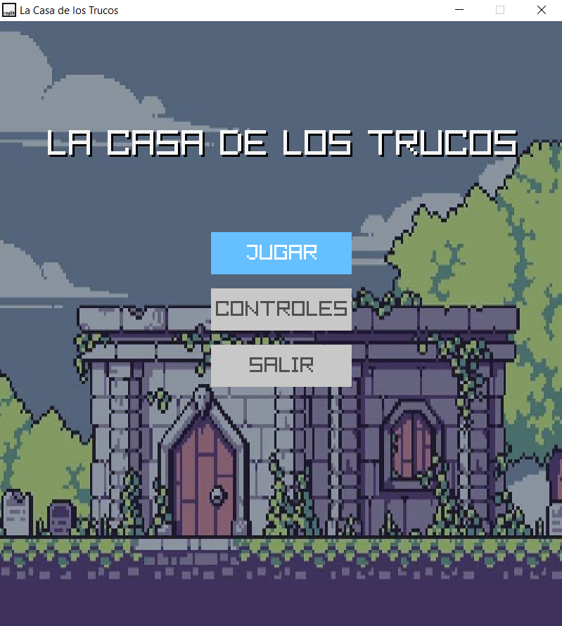
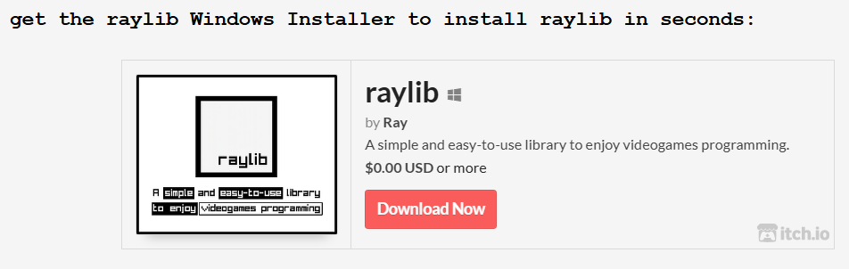
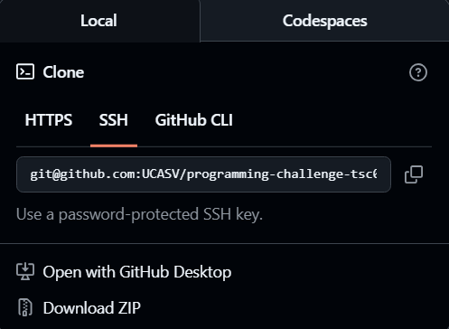
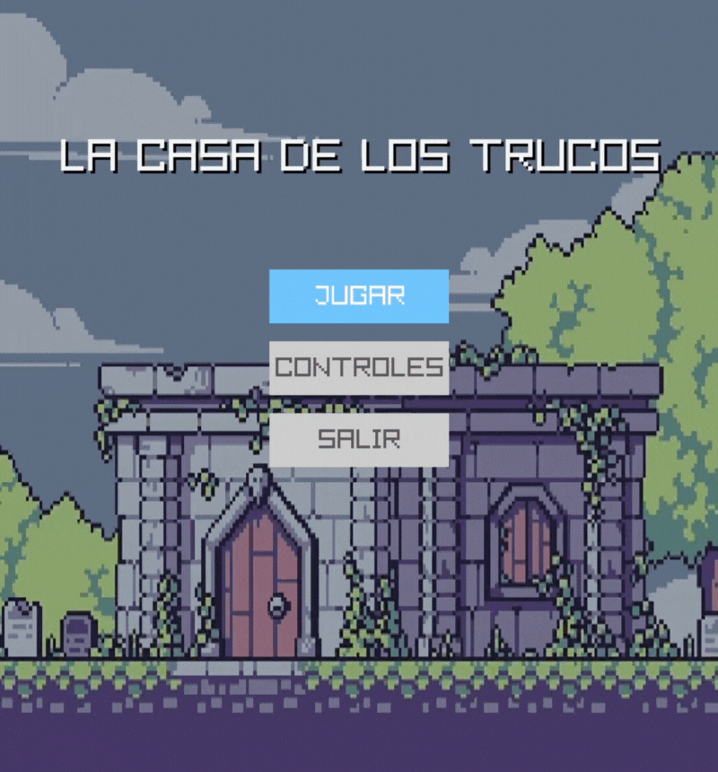
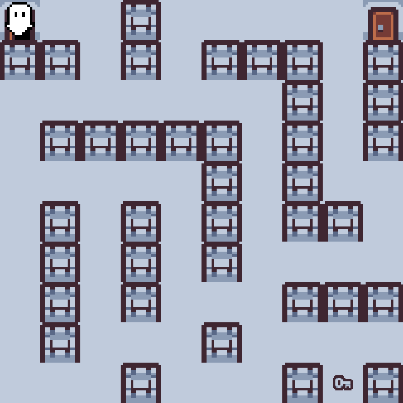
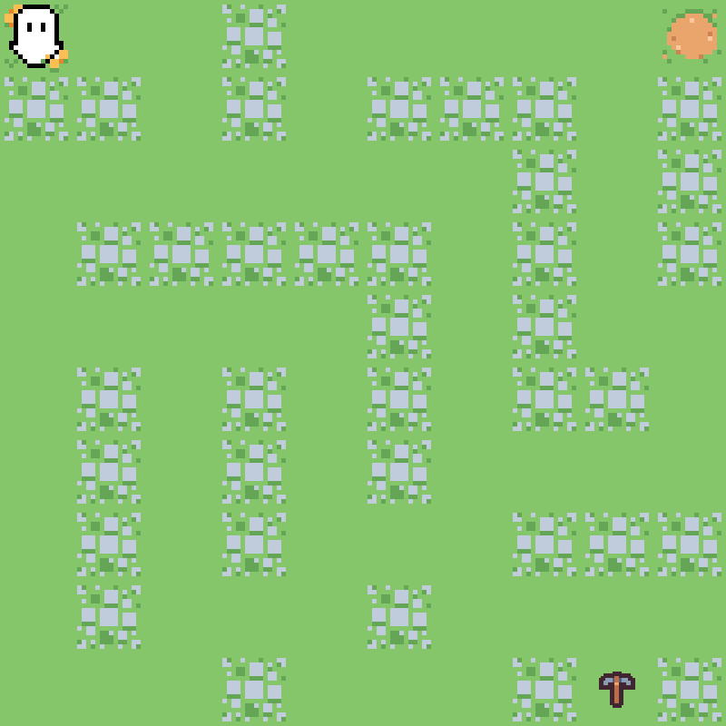
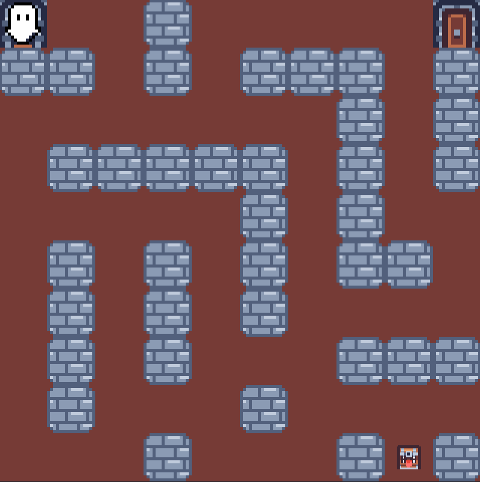
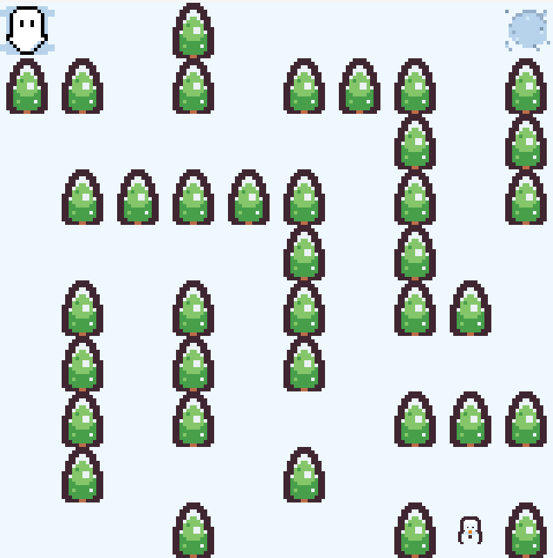

# La Casa de los Trucos


## Descripción General

"La Casa de los Trucos" es un puzzle game ambientado en un grid 2D, los jugadores deben navegar a través del laberinto que se muestre y así poder llegar a la salida. Posee dinámicas como paredes que se mueven, paredes que se convierten en caminos transitables y un sistema de barra de energía que al llenarse puede ayudar a romper paredes.

**Características principales:**

- Laberintos con paredes que cambian de posición cada turno.
- Paredes que se convierten en caminos transitables.
- Barra de energía que se carga al moverse y permite romper una pared.
- Recolección de items en cada nivel.
- Diversas temáticas visuales como Castillo y Hielo.
- Solución automática del laberinto con visualización del camino.

## Instrucciones de Compilación

**Requisitos previos:**

- Visual Studio Code.
- Tener instalado Git.
- Extensión de C/C++ en Visual Studio Code.
- Compilador de C++ (en Ubuntu). ACLARACIÓN: El instalador de raylib para el sistema operativo Windows ya incluye un compilador, es por esto que no es necesario tener uno extra aunque si se desea puede hacerse.

### Windows

1. Descargar el instalador de raylib desde su [sitio oficial](https://www.raylib.com/).



2. Clonar este repositorio en la rama principal (main), ya sea con HTTPS o SSH. NOTA: Debe realizarse en el Escritorio o Desktop.



3. Dirigirse a la carpeta [src](src/) y buscar el archivo [main.cpp](src/main.cpp).

4. Presionar la tecla F5.

### Linux (Ubuntu)

1. Instalar raylib en la carpeta Home del usuario (por ejemplo, /home/mj/).
1. En la terminal, ejecutar:

````
sudo apt install libasound2-dev libx11-dev libxrandr-dev libxi-dev libgl1-mesa-dev libglu1-mesa-dev libxcursor-dev libxinerama-dev libwayland-dev libxkbcommon-dev
git clone --depth 1 https://github.com/raysan5/raylib.git raylib
cd raylib/src/
make PLATFORM=PLATFORM_DESKTOP
make PLATFORM=PLATFORM_DESKTOP RAYLIB_LIBTYPE=SHARED
sudo make install RAYLIB_LIBTYPE=SHARED
````

NOTA: Asegurar que raylib se haya instalado en la carpeta Home del usuario (por ejemplo, /home/mj/).

2. Clonar este repositorio en la rama principal (main). NOTA: Debe realizarse en el Escritorio o Desktop.

3. Dirigirse a la carpeta [src](src/) y buscar el archivo [main.cpp](src/main.cpp).

4. Presionar la tecla F5.

## Cómo Jugar

1. **Objetivo:** Alcanzar la salida recolectando items en el camino.

2. **Mecánicas clave:**
   - **Movimiento:** Usa las flechas direccionales o W-A-S-D para mover al personaje.

   - **Energía:** Cada paso carga tu barra de energía. Cuando esté llena, podrás romper una sola pared con la tecla ESPACIO en la dirección de tu último movimiento. La barra seguirá llenandose luego de usar este poder, pero ya no podrá romper paredes nuevamente.

   - **Coleccionables:** Recolecta todos los ítems mientras recorres el camino (opcional).

   - **Solución:** Presiona la tecla C para mostrar/ocultar el camino óptimo de resolución para el laberinto. Al mostrarse el camino, el jugador se moverá por si solo.

3. **Dificultad:**
   - Las paredes cambian de posición periódicamente.
   - Algunas paredes desaparecen después de un número determinado de turnos.
   - Planifica tus movimientos estratégicamente para no quedarte atrapado por mucho tiempo.

## Controles

| Acción                  | Teclado       |
|-------------------------|---------------|
| Movimiento en el juego  | WASD/Flechas  |
| Romper pared            | ESPACIO       |
| Solucionar laberinto    | C             |
| Pausa                   | ESC           |
| Navegar menús           | WASD/Flechas  |
| Seleccionar opción      | ENTER         |

## Capturas de Pantalla

### Gameplay



### Temáticas del juego

| Castillo |  Bosque  |
|----------|----------|
|  |  |

| Calabozo |   Hielo  |
|----------|----------|
|  |  |

## Reporte

El [reporte](docs/REPORTE.md) incluye:

- Algoritmos utilizados y cómo fueron implementados.
- Investigación sobre la biblioteca gráfica seleccionada y un pequeño manual sobre su uso.
- Cómo se manejó la visualización del camino más óptimo.
- Desafíos enfrentados en el proceso y soluciones implementadas.

## Video de explicación

Este [video](docs/lacasadelostrucos-video.mp4) incluye:

- Funcionalidades del juego.
- Cómo se implementó el algoritmo.
- Explicación del algoritmo utilizado.

## Licencia

Este proyecto está bajo la licencia [MIT](LICENSE).

## Créditos

- **Desarrollado por:** 

    - Erika Sofía Hernández Cortéz 00161220
    - Diego Sebastián Jiménez Artiga 00074720
    - María José Morales Ávalos 00155020

- **Asignatura:** Técnicas de Simulación en Computadoras

- **Universidad:** Universidad Centroamericana José Simeón Cañas

- **Bibliotecas:** [Raylib](https://www.raylib.com/) - Copyright (c) 2013-2025 Ramon Santamaria (@raysan5)